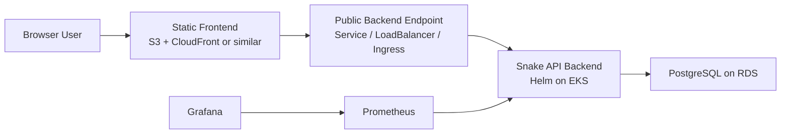
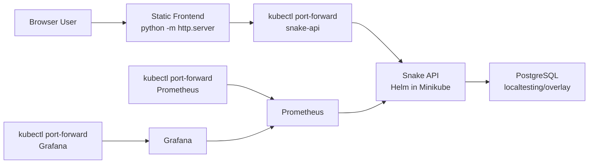

# Architecture Notes

This document describes the intended target architecture and the local validation setup used before AWS access is available.

## Production shape

## AWS infrastructure

The Terraform layer provisions:

- one VPC across two availability zones
- public subnets for internet-facing access
- private subnets for EKS worker nodes
- isolated database subnets for RDS
- an EKS cluster with a small managed node group
- a PostgreSQL RDS instance reachable from the application tier only

The infrastructure entry point is [`envs/dev/main.tf`](C:\Users\ivanm\projekti\incode\incode-assignment\envs\dev\main.tf), which wires:

- [`modules/network`](C:\Users\ivanm\projekti\incode\incode-assignment\modules\network)
- [`modules/eks`](C:\Users\ivanm\projekti\incode\incode-assignment\modules\eks)
- [`modules/rds`](C:\Users\ivanm\projekti\incode\incode-assignment\modules\rds)

## Application layer

The application is intentionally split into:

- a static frontend in [`app/public/index.html`](C:\Users\ivanm\projekti\incode\incode-assignment\app\public\index.html)
- a backend API in [`backend/server.js`](C:\Users\ivanm\projekti\incode\incode-assignment\backend\server.js)

Why this split:

- the frontend is fully static and better hosted outside Kubernetes
- the backend is the Kubernetes workload required by the exercise
- the backend is the component that needs connectivity to PostgreSQL
- this keeps the runtime surface area smaller than serving both layers from inside the cluster

## Kubernetes deployment model

The Kubernetes app layer is Helm-based.

The backend chart lives in [`helm/snake-api`](C:\Users\ivanm\projekti\incode\incode-assignment\helm\snake-api) and includes:

- `Deployment`
- `Service`
- optional DB `Secret`
- optional `ServiceMonitor`

Environment-specific values:

- local: [`helm/values-local.yaml`](C:\Users\ivanm\projekti\incode\incode-assignment\helm\values-local.yaml)
- AWS: [`helm/values-aws.yaml`](C:\Users\ivanm\projekti\incode\incode-assignment\helm\values-aws.yaml)

## Data model

The backend stores leaderboard entries in PostgreSQL with:

- `id`
- `username`
- `highest_score`
- `updated_at`

Behavior:

- `username` is unique
- a new username creates one row
- submitting a lower score keeps the stored high score unchanged
- submitting a higher score updates the stored high score and timestamp

## Observability

The backend exposes:

- `/healthz`
- `/metrics`

Prometheus scrapes the application through a `ServiceMonitor` when enabled.

Grafana reads from Prometheus for visualization.

Observed metric groups:

- HTTP request volume and latency
- health check success/error results
- leaderboard reads
- score submission outcomes
- invalid submission reasons
- high-score upsert outcomes
- DB query count and latency
- DB connection pool gauges

See [`docs/observability.md`](C:\Users\ivanm\projekti\incode\incode-assignment\docs\observability.md) for the live demo queries and dashboard plan.

## Local validation setup

Before AWS access is available, the project can be validated locally with Minikube:

Local-only assets live under [`localtesting`](C:\Users\ivanm\projekti\incode\incode-assignment\localtesting).

That workflow:

- starts Minikube
- builds the backend image into Minikube
- applies local PostgreSQL manifests
- installs the backend Helm chart
- optionally installs `kube-prometheus-stack`
- writes frontend config for local forwarding
- starts local port-forwards for backend, Prometheus, and Grafana

## Design choices and trade-offs

### Why Terraform for infra

- keeps AWS resources reproducible
- makes teardown straightforward
- gives a clear source of truth for networking, EKS, and RDS

### Why Helm for Kubernetes

- cleaner parameterization than duplicating manifests
- easier local vs AWS values management
- natural fit for enabling `ServiceMonitor`
- easier to explain as the application deployment unit

### Why not host the frontend in EKS

- the frontend is static
- static hosting is cheaper and simpler
- EKS is reserved for the backend/API workload that actually needs compute and DB access

### Why kube-prometheus-stack

- standard Prometheus Operator setup
- native `ServiceMonitor` support
- easy Grafana integration
- heavier than a minimal demo stack, but stronger from an SRE demonstration perspective

## Interview summary

Short version you can say out loud:

- Terraform provisions the AWS foundation: VPC, EKS, and RDS.
- The frontend is static and hosted separately.
- The backend runs on Kubernetes and persists highscores in PostgreSQL.
- Helm manages both the application deployment and the monitoring stack.
- Prometheus scrapes application metrics, and Grafana visualizes HTTP, business, and database behavior.
