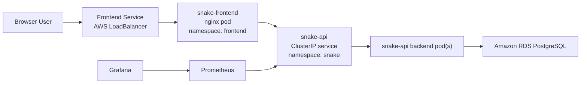

# Architecture Notes

This document reflects the current repository state and deployed topology.

## AWS Topology

## Infrastructure Ownership

Terraform manages:

- VPC
- public/private/database subnets
- EKS cluster
- EKS managed node group
- RDS PostgreSQL

Terraform entry point:

- [`envs/dev/main.tf`](../envs/dev/main.tf)

Terraform modules:

- [`modules/network`](../modules/network)
- [`modules/eks`](../modules/eks)
- [`modules/rds`](../modules/rds)

Terraform does not manage the application workloads.

## Kubernetes Deployment Model

Helm manages the runtime workloads.

### Backend

Chart:

- [`helm/snake-api`](../helm/snake-api)

Namespace:

- `snake`

Service model:

- `ClusterIP`

Responsibilities:

- exposes `/api/scores`
- exposes `/healthz`
- exposes `/metrics`
- connects to PostgreSQL on RDS

### Frontend

Chart:

- [`helm/snake-frontend`](../helm/snake-frontend)

Namespace:

- `frontend`

Service model:

- `LoadBalancer`

Responsibilities:

- serves static frontend assets through nginx
- proxies `/api/*` to `snake-api.snake.svc.cluster.local`

This keeps the backend private while still giving the browser a simple same-origin public entry point.

## Monitoring

Monitoring components are installed with:

- `prometheus-community/kube-prometheus-stack`
- [`helm/snake-grafana-dashboards`](../helm/snake-grafana-dashboards)

Namespace:

- `monitoring`

Monitoring is optional in the application workflow, but when enabled it deploys:

- Prometheus
- Grafana
- Prometheus Operator components
- provisioned Grafana dashboard

## Data Model

Leaderboard table columns:

- `id`
- `username`
- `highest_score`
- `updated_at`

Behavior:

- each username is unique
- inserts create a new row
- lower repeated scores do not overwrite the stored high score
- higher repeated scores update the high score and timestamp

## Secrets Model

AWS uses RDS-managed master credentials:

- AWS stores the master password in Secrets Manager
- application workflow reads the generated secret
- workflow creates Kubernetes secret `snake-api-db`
- backend reads `host`, `port`, `dbname`, `username`, and `password` from that secret

## Local Validation Topology

Local validation assets:

- [`localtesting`](../localtesting)

## Design Notes

- frontend is exposed through a public `LoadBalancer`
- backend stays private behind `ClusterIP`
- frontend proxies `/api/*` to the in-cluster backend service
- `kube-prometheus-stack` is convenient, but on a very small node group it can exhaust pod density
