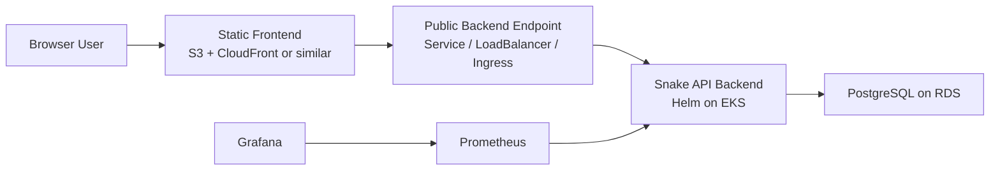
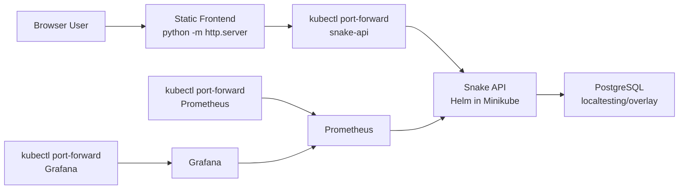

# Architecture Notes

This document describes the target AWS architecture and the local validation topology used before cloud access is available.

## Target topology

## AWS infrastructure

The Terraform layer provisions:

- one VPC across two availability zones
- public subnets for internet-facing access
- private subnets for EKS worker nodes
- isolated database subnets for RDS
- an EKS cluster with a small managed node group
- a PostgreSQL RDS instance reachable only from the application tier

The infrastructure entry point is [`envs/dev/main.tf`](../envs/dev/main.tf), which composes:

- [`modules/network`](../modules/network)
- [`modules/eks`](../modules/eks)
- [`modules/rds`](../modules/rds)

## Application topology

The application is split into:

- a static frontend in [`app/public/index.html`](../app/public/index.html)
- a backend API in [`backend/server.js`](../backend/server.js)

This separation keeps the static delivery path simple and reserves Kubernetes for the component that requires database connectivity and runtime compute.

## Kubernetes deployment model

The Kubernetes deployment layer is Helm-based.

The backend chart is stored in [`helm/snake-api`](../helm/snake-api) and includes:

- `Deployment`
- `Service`
- optional database `Secret`
- optional `ServiceMonitor`

Environment-specific values are defined in:

- [`helm/values-local.yaml`](../helm/values-local.yaml)
- [`helm/values-aws.yaml`](../helm/values-aws.yaml)

## Data model

The leaderboard table stores:

- `id`
- `username`
- `highest_score`
- `updated_at`

Application behavior:

- `username` is unique
- a new username creates a row
- a lower repeated score leaves the stored high score unchanged
- a higher repeated score updates the stored high score and timestamp

## Secrets model

For AWS, the PostgreSQL master password is managed by AWS:

- the RDS instance is configured with AWS-managed master credentials
- AWS generates the password
- AWS stores the password in Secrets Manager
- Terraform exposes the resulting secret ARN

This avoids storing the master password in repository-managed variables.

## Observability model

The backend exposes:

- `/healthz`
- `/metrics`

Prometheus scrapes the backend through a `ServiceMonitor` when enabled. Grafana uses Prometheus as its data source. In AWS, the monitoring stack is deployed by the application workflow rather than the Terraform workflow.

Observed metric categories:

- HTTP request volume and latency
- health check success and error results
- leaderboard reads
- score submission outcomes
- invalid submission reasons
- high-score upsert outcomes
- database query count and latency
- database connection pool gauges

Additional observability detail is documented in [`docs/observability.md`](./observability.md).

## Local validation topology

Before AWS access is available, the project can be validated locally with Minikube:

The local validation assets are stored in [`localtesting`](../localtesting).

The local workflow:

- starts Minikube
- builds the backend image into Minikube
- applies the local PostgreSQL manifests
- installs the backend Helm chart
- optionally installs `kube-prometheus-stack`
- writes frontend configuration for local forwarding
- starts local port-forwards for the backend, Prometheus, and Grafana

## Design trade-offs

### Terraform for infrastructure

- reproducible AWS resource definitions
- clear source of truth for networking, EKS, and RDS
- straightforward teardown and rebuild workflow

### Helm for Kubernetes deployment

- consistent parameterization across local and AWS environments
- natural support for optional `ServiceMonitor` resources
- cleaner packaging than duplicated raw manifests

### Static frontend outside EKS

- lower runtime complexity
- lower cost for the static tier
- clearer separation between static delivery and stateful application logic

### kube-prometheus-stack

- standard Prometheus Operator deployment model
- native `ServiceMonitor` support
- integrated Grafana workflow
- heavier than a minimal monitoring deployment, but closer to a common production pattern

## Summary

- Terraform manages the AWS foundation: VPC, EKS, and RDS.
- The frontend is static and hosted separately.
- The backend runs on Kubernetes and persists highscores in PostgreSQL.
- Helm manages both the application deployment and the monitoring stack.
- Prometheus scrapes application metrics and Grafana visualizes HTTP, business, and database behavior.
